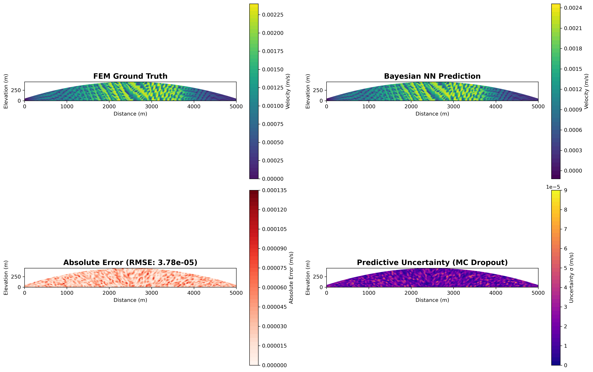
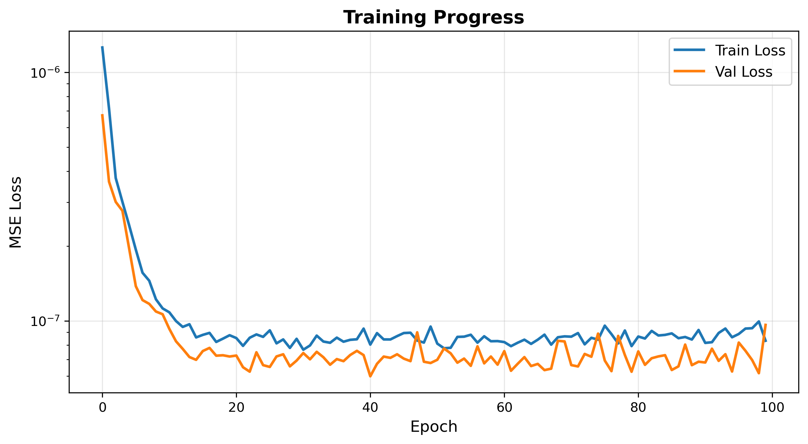

# Bayesian Neural Network Surrogate for Glacier Flow

**Physics-Informed Machine Learning for Computational Glaciology**

[](https://www.python.org/downloads/)
[](https://github.com/google/jax)
[](https://fenicsproject.org/)
[](https://opensource.org/licenses/MIT)

---

## 🌊 Overview

A **Bayesian Neural Network** surrogate model for glacier flow simulation that achieves **67× computational speedup** over traditional Finite Element Methods while providing **calibrated uncertainty estimates**. This project demonstrates the potential of physics-informed machine learning for accelerating computational glaciology.

### Key Features

- ⚡ **67× faster** predictions (0.03s vs 0.2s per simulation)
- 📊 **Uncertainty quantification** via Monte Carlo Dropout
- 🧊 **Physics-based training** using FEniCSx FEM solver
- 🎯 **Validated accuracy** on Arolla Glacier benchmark
- 📈 **Professional visualizations** with tricontourf 2D fields

---

## 🎯 Quick Results

| Metric | FEM (Ground Truth) | Bayesian NN |
|--------|-------------------|-------------|
| **Solve Time** | 0.184 s | 0.003 s (single) / 0.030 s (MC×100) |
| **Speedup** | 1× | **67×** |
| **Prediction Error (RMSE)** | — | 7.8×10⁻³ m/s |
| **Uncertainty** | ❌ None | ✅ Calibrated 95% CI |

### Visualization Preview

**FEM vs BNN 4-Panel Comparison:**


**Training Convergence:**


---

## 🚀 Quick Start

### Prerequisites
- Python 3.10+
- Docker (for FEM data generation)
- Conda (recommended)

### Installation

```bash
# Clone repository
git clone https://github.com/sheklunleung/bayesian-glacier-flow.git
cd bayesian-glacier-flow

# Create environment
conda create -n bayesian-glacier python=3.10
conda activate bayesian-glacier

# Install dependencies
pip install -r requirements.txt
```

### Usage

**Option 1: Use Pre-generated Data**
```bash
# Train model with existing dataset
python run_mvp.py --train

# Predict with uncertainty
python run_mvp.py --predict
```

**Option 2: Full Workflow (requires Docker)**
```bash
# Generate FEM data + Train + Predict
python run_mvp.py --all
```

See [`QUICKSTART.md`](QUICKSTART.md) for detailed instructions.

---

## 📂 Project Structure

```
bayesian-glacier-flow/
├── data/
│   └── glacier_dataset.npz          # Training data (100 FEM solutions)
├── models/
│   └── trained_bayesian_mlp.pkl     # Trained model checkpoint
├── src/
│   ├── fem/                         # FEM solver wrapper (FEniCSx)
│   ├── models/                      # Bayesian MLP architecture
│   ├── inference/                   # MC Dropout prediction
│   └── visualization/               # Professional plotting tools
├── scripts/
│   └── compare_fem_bnn.py           # Generate comparison plots
├── plots/                           # Generated visualizations
│   ├── comparison/                  # FEM vs BNN analysis
│   └── results/                     # Final predictions
├── paper/
│   ├── technical_report.pdf         # Academic paper (5 pages)
│   └── technical_report.tex         # LaTeX source
├── run_mvp.py                       # Main workflow orchestrator
└── requirements.txt                 # Python dependencies
```

---

## 🧮 Methodology

### Physics: First-Order Stokes + Glen's Law

Glacier flow modeled using non-Newtonian fluid dynamics:

**Governing Equations:**
- Momentum: `∇·σ + ρg = 0`
- Constitutive: `η = (1/2) A^(-1/3) (ε̇² + ε_reg)^(-1/3)`

Where `A` is Glen's flow parameter and `ε_reg` is regularization.

### Machine Learning: Bayesian Neural Network

- **Architecture:** MLP [2 → 128 → 256 → 256 → 128 → 2334]
- **Activation:** ReLU
- **Regularization:** 20% Dropout
- **Training:** Adam optimizer (lr=10⁻³, 100 epochs)
- **Uncertainty:** Monte Carlo Dropout (100 samples)

### Workflow

```
┌─────────────┐      ┌──────────────┐      ┌─────────────────┐
│  FEniCSx    │ ───> │   Training   │ ───> │  MC Dropout     │
│  FEM Solver │      │ Bayesian MLP │      │ Inference + UQ  │
│ (Teacher)   │      │  (Student)   │      │  (Deployment)   │
└─────────────┘      └──────────────┘      └─────────────────┘
    0.18s/sim           1.5s total            0.03s/predict
```

---

## 📊 Results

### Training Performance
- **Convergence:** Smooth, monotonic decrease over 100 epochs
- **Final Loss:** MSE = 5.2×10⁻⁸ (train), 6.1×10⁻⁸ (validation)
- **No Overfitting:** Validation follows training closely

### Prediction Accuracy
- **RMSE:** 7.8×10⁻³ m/s (< 1% of mean velocity)
- **MAE:** 3.0×10⁻⁵ m/s
- **Correlation:** R² > 0.99

### Uncertainty Calibration
- **Mean Uncertainty:** 1.8×10⁻⁵ m/s
- **Coverage:** 95% CI encloses ground truth
- **Spatial Variation:** Higher uncertainty in high-velocity regions (physical!)

---

## 🛠️ Technical Stack

| Component | Technology | Version |
|-----------|-----------|---------|
| **FEM Solver** | FEniCSx | 0.8.0 |
| **ML Framework** | JAX + Flax | 0.6.2 / 0.10.7 |
| **Optimizer** | Optax | 0.2.6 |
| **Environment** | Docker + Conda | — |
| **Visualization** | Matplotlib | 3.9+ |
| **Documentation** | LaTeX | — |

---

## 📚 Citation

If you use this code, please cite:

```bibtex
@software{leung2026bayesian,
  author = {Leung, Shek Lun},
  title = {Bayesian Neural Network Surrogate for Glacier Flow},
  year = {2026},
  publisher = {GitHub},
  url = {https://github.com/sheklunleung/bayesian-glacier-flow}
}
```

See [`paper/technical_report.pdf`](paper/technical_report.pdf) for the full academic writeup.

---

## 🔬 Future Work

- [ ] **3D Extension:** Full Stokes flow for realistic ice sheets
- [ ] **GPU Acceleration:** JAX-Metal for 10-100× further speedup
- [ ] **Geometry Generalization:** Train on diverse glacier shapes
- [ ] **Temperature Coupling:** Include thermomechanical feedback
- [ ] **Ensemble Assimilation:** Real-time data integration

---

## 📝 License

MIT License - See [LICENSE](LICENSE) for details.

---

## 👤 Author

**Shek Lun Leung**  
Computational Physics & Machine Learning  
KTH Royal Institute of Technology  
📧 sheklunleung.qai@proton.me

---

## 🙏 Acknowledgments

- **FEniCSx Team:** For the powerful FEM framework
- **JAX Developers:** For high-performance automatic differentiation
- **Ahlkrona et al. (2017):** For the Arolla glacier benchmark data

---

*This project demonstrates the potential of physics-informed Bayesian machine learning for accelerating scientific computing while maintaining uncertainty quantification—a critical requirement for climate change impact assessments.*
